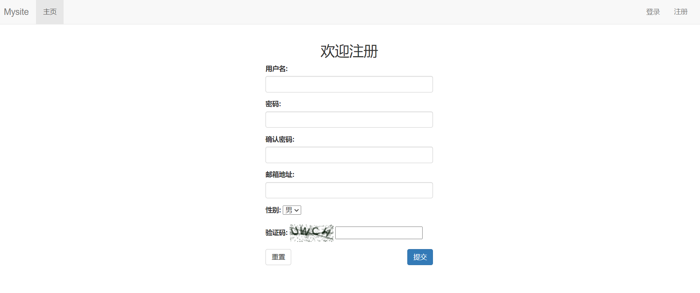

# 实现可重用注册登录

主要涉及模块：
**django表单**
Django的表单提供了下面三个主要功能：
1.准备和重构数据用于页面渲染；
2.为数据创建HTML表单元素；
3.接收和处理用户从表单发送过来的数据。

**图片验证码-django-simple-captcha**

**发送邮件，注册确认**
setting文件中配置
EMAIL_BACKEND = 'django.core.mail.backends.smtp.EmailBackend'
EMAIL_HOST = 'smtp.sina.com'
EMAIL_PORT = 25
EMAIL_HOST_USER = 'xxx@sina.com'
EMAIL_HOST_PASSWORD = 'xxxxxxxxxxx'

